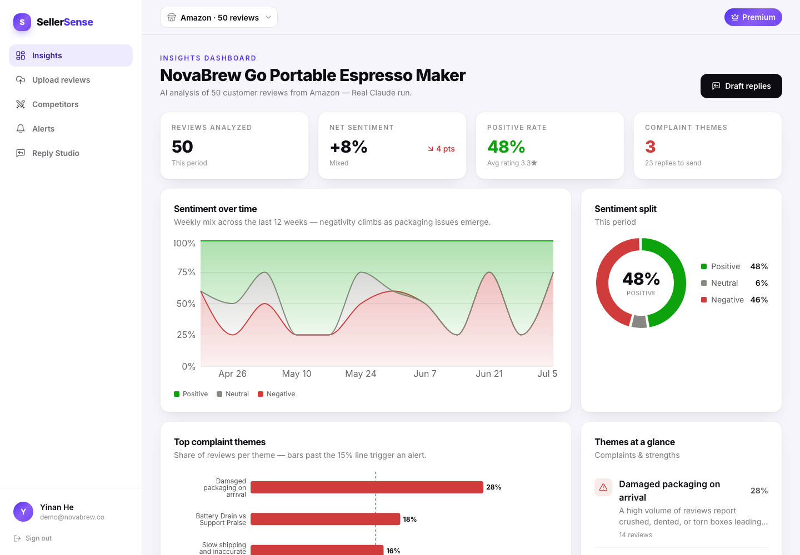

# SellerSense

[](https://github.com/Yinan920/Capstone/actions/workflows/ci.yml)

AI-driven customer-feedback intelligence for small/medium e-commerce sellers:
upload store reviews → async AI analysis (sentiment, theme clustering, complaint
keywords, alerts) → insights dashboard, competitor benchmarking, and reply drafts.

**Live demo (Firebase Hosting → GCP Cloud Run + Cloud SQL):** https://sellersense-ai.web.app
— sign in with `demo@novabrew.co` / `demo1234!` (premium) or register a free account.
Architecture, commands, and the decisions-and-pitfalls writeup: [docs/deployment.md](docs/deployment.md).

## AI providers: a deliberate two-mode design

Every AI capability — sentiment scoring, embeddings, theme labeling, reply drafting — sits
behind an adapter interface ([backend/app/integrations/](backend/app/integrations/)). Two
interchangeable implementations ship:

| | Mock adapters (local + CI default) | Real Claude (**deployed**) |
|---|---|---|
| Cost / keys | $0, no API key | metered, needs `ANTHROPIC_API_KEY` |
| Output | deterministic — same input, same result | model-generated, varies in wording |
| Used for | local development, the test suites, reproducible grading | the live demo, production-grade analysis |
| Models | — | Haiku 4.5 (batched sentiment, structured output), Sonnet 5 (theme summaries, replies) |

**The live demo runs real Claude** (`LLM_PROVIDER=anthropic`, `EMBEDDINGS_PROVIDER=mock`), so
what you see at the demo URL is genuine model output, not a canned heuristic. A fresh clone,
by contrast, runs entirely on the deterministic mocks: **zero API keys**, and a test suite
that can't flake on a model's wording.

Switching is **configuration, not code** — the `anthropic` SDK is baked into the production
image, so either direction is one command and no rebuild:

```bash
# deployed default: real Claude
gcloud run services update sellersense --region us-central1 \
  --set-secrets ANTHROPIC_API_KEY=anthropic-api-key:latest,DATABASE_URL=database-url:latest,JWT_SECRET=jwt-secret:latest \
  --set-env-vars LLM_PROVIDER=anthropic,EMBEDDINGS_PROVIDER=mock

# fall back to the free, deterministic adapters (also the incident workaround)
gcloud run services update sellersense --region us-central1 \
  --set-env-vars LLM_PROVIDER=mock,EMBEDDINGS_PROVIDER=mock

# check which one is live right now
gcloud run services describe sellersense --region us-central1 \
  --format='value(spec.template.spec.containers[0].env)' | tr ',' '\n' | grep PROVIDER
```

Two consequences of running the real path in public, stated plainly: every upload on the demo
URL is a metered API call, and analysis wording differs between runs — so tests must assert
structure and topic, never exact strings ([docs/03-issue-log.md, issue 14](docs/03-issue-log.md#issue-14--e2e-suite-broke-when-production-switched-from-mock-adapters-to-real-claude)).

### Mock vs real, measured

Both paths were run end-to-end on the deployed service — same 50-review CSV, same pipeline,
only the adapter swapped. Real Claude analyzed all 50 reviews in ~8 s warm on the deployed
service and produced measurably sharper analysis:



| | Mock adapter | Real Claude (Sonnet 5) |
|---|---|---|
| Theme label | "Packaging damage" | "Damaged packaging on arrival" |
| Theme summary | *"Customers frequently mention box, arrived, machine. Recurring complaint driver."* | *"A high volume of reviews report crushed, dented, or torn boxes leading to damaged or cracked units on arrival, sometimes on repeat orders; while support/replacements are praised when needed, packaging quality is a recurring and significant pain point."* |
| Complaint themes found | 2 | **3** — correctly caught the battery-drain cluster the keyword heuristic mislabeled as neutral |
| Net sentiment | +15% | +8% (harsher, more nuanced on 2-star reviews) |
| Reply drafts | template keyed on theme | written to the specific review — cites the opened box *and* the missing manual, offers a matching remedy |

That last row of the mock column is the honest tradeoff: the deterministic adapters are
keyword-driven, so they occasionally mislabel a mixed cluster. Real Claude fixes it. Both
are one env var apart.

Monorepo:

- `frontend/` — React 18 + TypeScript + Vite + Tailwind + Recharts, fully integrated with the backend (JWT auth, upload flow with live job progress; `VITE_USE_MOCKS=true` restores the standalone mock demo)
- `backend/` — FastAPI + SQLAlchemy 2.0 async + PostgreSQL 16 + pgvector
- `docs/` — API spec, database design, test cases & results

A fresh clone runs with **zero API keys**: locally, all AI providers (LLM, embeddings, email)
default to the deterministic mock adapters selected by config. The key is only needed to run
the real Claude path, which is how the deployment is configured.

## Quick start

### 1. Database (PostgreSQL 16 + pgvector)

```bash
docker compose up -d          # starts sellersense-db on localhost:5432
```

No Docker? Any Postgres with pgvector works — point `DATABASE_URL` in `.env` at it
(e.g. Homebrew: `brew install postgresql@16 pgvector`).

### 2. Backend

```bash
cd backend
python3.11 -m venv .venv && source .venv/bin/activate   # 3.11+
pip install -e ".[dev]"
cp ../.env.example ../.env    # defaults work as-is
alembic upgrade head          # create tables (enables pgvector)
uvicorn app.main:app --reload --port 8000
```

Check: `curl http://localhost:8000/api/health` → `{"status":"ok","database":"up",...}`

### 3. Demo data (optional)

```bash
cd backend && python -m scripts.seed
# demo login: demo@novabrew.co / demo1234!  (premium tier)
# a 50-row sample upload file lives at backend/data/sample_reviews.csv
```

### 4. Tests

```bash
cd backend && pytest               # 61 tests (uses the sellersense_test DB)
bash scripts/smoke.sh              # 13-step curl smoke against the running local server
bash scripts/smoke_cloud.sh        # 10-check smoke against the deployed service (safe: throwaway account)

cd ../frontend && npm test         # 24 component/contract tests
node e2e/acceptance.mjs            # browser E2E (BASE=https://sellersense-ai.web.app for the deployment)
```

### 5. Frontend (optional, mock mode by default)

```bash
cd frontend
npm install && npm run dev    # http://localhost:5173
```

## Documentation

**Start here: [docs/README.md](docs/README.md)** — the documentation index, with a table of
contents covering all of the below.

- [docs/01-production-support.md](docs/01-production-support.md) — dependency map, monitoring, incident playbooks, and every test suite with executed results
- [docs/02-setup-guide.md](docs/02-setup-guide.md) — set up database, backend and frontend from scratch, with validation at every step
- [docs/03-issue-log.md](docs/03-issue-log.md) — 16 issues: symptom, diagnosis, research, fix, verification
- [docs/04-user-guide.md](docs/04-user-guide.md) — end-user guide with screenshots and known limitations
- [docs/05-architecture.md](docs/05-architecture.md) — architecture diagram, communication flows, deployment pipeline, security
- [docs/api-spec.md](docs/api-spec.md) — all 19 APIs with sample JSON input/output
- [docs/db-design.md](docs/db-design.md) — ERD + table DDL
- [docs/deployment.md](docs/deployment.md) — the reproducible GCP deploy, plus decisions and pitfalls
- [docs/benchmarks.md](docs/benchmarks.md) — every performance and cost number, and how it was measured
- [docs/evaluation.md](docs/evaluation.md) — sentiment accuracy against a 230-review labelled gold set, vs two baselines
- [docs/test-cases.md](docs/test-cases.md) / [docs/test-results.md](docs/test-results.md) — API test cases and executed results
