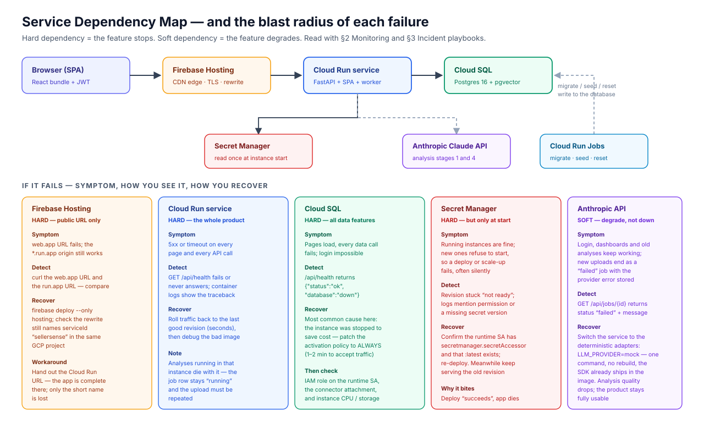

# 1. Production Support & Testing Scenarios

**Audience:** whoever maintains SellerSense after the original team hands it over.
**Purpose:** know what depends on what, see that the system is healthy, recover when it is not, and re-run every test that proves the system works.

All results in this document were **executed on 2026-08-24** — locally on macOS 15 (Darwin 24.3.0, Apple silicon) and against the live deployment at https://sellersense-ai.web.app. Nothing here is quoted from an earlier run.

---

## Table of contents

1. [Service dependency diagram](#11-service-dependency-diagram)
2. [Monitoring — logs, health checks, metrics](#12-monitoring--where-to-look)
3. [Setup validation](#13-setup-validation)
4. [Common incidents & recovery steps](#14-common-incidents--recovery-steps)
5. [Post-deployment smoke tests (system validation)](#15-post-deployment-smoke-tests-system-validation)
6. [Testing scenarios & results](#16-testing-scenarios--results)
   - [6.1 Unit & integration tests — backend](#161-backend-unit--integration-tests-pytest--44-passed)
   - [6.2 Unit tests — frontend](#162-frontend-unit--component-tests-vitest--20-passed)
   - [6.3 End-to-end browser tests](#163-end-to-end-browser-tests-playwright--3-suites-passed)
   - [6.4 Manual test cases (expected vs actual)](#164-manual-test-cases-expected-vs-actual)
   - [6.5 What is not covered](#165-what-is-not-tested-stated-honestly)

---

## 1.1 Service dependency diagram



The critical request path is four hops: **browser → Firebase Hosting → Cloud Run → Cloud SQL**. Everything else is a supporting dependency.

| Component | Type | Depends on | If it fails | Recovery |
|---|---|---|---|---|
| **Firebase Hosting** (`sellersense-ai`) | Hard, edge only | Cloud Run service in the *same* GCP project | The short public URL stops; the Cloud Run origin URL still serves the whole app | Re-deploy hosting; hand out the `*.run.app` URL meanwhile → [I-6](#i-6--the-public-short-url-is-down-but-the-app-is-up) |
| **Cloud Run** `sellersense` | Hard | Cloud SQL, Secret Manager (at start), Anthropic API (soft) | Total outage — no pages, no API | Roll traffic back to the last good revision → [I-2](#i-2--the-service-returns-5xx-or-will-not-start) |
| **Cloud SQL** (Postgres 16 + pgvector) | Hard | — | Pages load, every data action fails, nobody can sign in | Most often the instance was stopped to save cost → [I-1](#i-1--database-connection-lost) |
| **Secret Manager** | Hard, at instance start | IAM role on the runtime SA | Running instances stay healthy; **new** instances refuse to start, so deploys and scale-ups fail | Fix the IAM binding / secret version, re-deploy → [I-3](#i-3--a-new-revision-will-not-start-secrets--iam) |
| **Anthropic Claude API** | **Soft** | Network, API key, quota | Existing data keeps working; new uploads finish as `failed` jobs | Switch to the deterministic adapters with one command → [I-4](#i-4--ai-provider-failure-analyses-fail-while-everything-else-works) |
| **Cloud Run Jobs** (migrate/seed/reset) | Operational | Same image, Cloud SQL | No user-facing impact; schema changes and demo resets are blocked | Re-run the job; read its execution logs |
| **Cloud Build + Artifact Registry** | Build-time | — | Cannot ship new code; the running revision is unaffected | Retry the build; deploy a previously built image |

**Internal dependency worth knowing:** the analysis worker runs **in the same process as the API** (FastAPI `BackgroundTasks`), so the API and the pipeline share a failure domain. That is a deliberate trade-off for this scale, and its boundary is documented in [I-5](#i-5--an-analysis-job-is-stuck-in-running).

---

## 1.2 Monitoring — where to look

### Health check endpoint

`GET /api/health` is the first thing to check, always. It deliberately distinguishes two very different failures:

```bash
curl -s https://sellersense-ai.web.app/api/health
# healthy:      {"status":"ok","database":"up","version":"0.1.0"}
# DB problem:   {"status":"ok","database":"down","version":"0.1.0"}   ← app is fine, database is not
# app problem:  (connection error / 5xx / no response)               ← the container itself
```

It is implemented in [`backend/app/api/health.py`](../backend/app/api/health.py) and runs a real `SELECT 1` against the connection pool — it is not a static "OK".

### Logs

| What | Where | Command |
|---|---|---|
| Application + request logs (production) | Cloud Logging, via stdout of the container | `gcloud run services logs read sellersense --region us-central1 --limit 100` |
| Live tail while reproducing | Cloud Logging | `gcloud beta run services logs tail sellersense --region us-central1` |
| One-off job output (migrate / seed / reset) | Cloud Logging, per execution | `gcloud run jobs executions list --region us-central1` then `... executions logs read <execution>` |
| Local backend | terminal running uvicorn | — |
| Local frontend | browser devtools console + network tab | — |
| Database errors | inside the same Cloud Run logs (SQLAlchemy raises through the request) | filter with `--log-filter='severity>=ERROR'` |

The app logs to stdout only — no log files are written, and Cloud Run's `/tmp` is an in-memory tmpfs, so nothing should be written there.

### Metrics and dashboards

| Signal | Where | What "normal" looks like |
|---|---|---|
| Request count, latency, instance count, container CPU/memory | Cloud Run → *Metrics* tab | 0 instances when idle (scale-to-zero); 1 during a demo |
| Cold start latency | Cloud Run metrics; also measured in [benchmarks.md](benchmarks.md#2-deployed-50-reviews-real-claude) | **~9 s** on the first request after idle, plus a **~10 s** one-time import cost on the first upload |
| Database CPU, connections, disk | Cloud SQL → *Overview* | tiny; `db-f1-micro` is deliberately small |
| Spend | Billing → *Budgets*: a **$25** budget alerts at 50% and 90% | Cloud SQL ≈ $9–11/month while running; Cloud Run ≈ cents |
| Pipeline health | the `analysis_jobs` table | every row ends `done` with `progress = 100` |

### Application-level health queries

Open a psql session against the production database with one command (it reads the password from Secret Manager and re-authorizes your current IP if needed):

```bash
cd backend && bash scripts/db-cloud.sh
```

Useful queries:

```sql
-- jobs that never finished (should return no rows)
SELECT id, dataset_id, status, progress, error, created_at
FROM analysis_jobs WHERE status <> 'done' ORDER BY created_at DESC LIMIT 20;

-- pipeline duration per job
SELECT id, status, finished_at - started_at AS duration, created_at
FROM analysis_jobs ORDER BY created_at DESC LIMIT 10;

-- volume by tier
SELECT u.tier, COUNT(DISTINCT u.id) AS users, COUNT(d.id) AS datasets
FROM users u LEFT JOIN datasets d ON d.user_id = u.id GROUP BY u.tier;
```

`scripts/db-cloud.sh "SELECT ..."` runs a single query non-interactively.

---

## 1.3 Setup validation

Confirming a fresh environment is correct is covered step by step in **[§2.9 Full-stack validation checklist](02-setup-guide.md#29-full-stack-validation-checklist)** (nine checks, from container health to a browser E2E run). For a deployed environment the equivalent is one command — `bash scripts/smoke_cloud.sh` — described in [§1.5](#15-post-deployment-smoke-tests-system-validation).

---

## 1.4 Common incidents & recovery steps

Each playbook lists the symptom, how to confirm the cause, how to fix it, and how to verify the fix.

### I-1 — Database connection lost

**Symptom.** The site loads but sign-in fails and every dashboard is empty or errors.
**Confirm.**

```bash
curl -s https://sellersense-ai.web.app/api/health
# {"status":"ok","database":"down","version":"0.1.0"}
```

**Most likely cause (this project).** The Cloud SQL instance was stopped deliberately to save money between demos.

**Recover.**

```bash
gcloud sql instances patch sellersense-db --activation-policy ALWAYS   # 1–2 min to accept traffic
gcloud sql instances describe sellersense-db --format='value(state)'   # wait for RUNNABLE
```

**If the instance was already running,** work down this list:

1. IAM — the runtime service account must hold `roles/cloudsql.client`:
   `gcloud projects get-iam-policy sellersense-yinan920 --flatten=bindings --filter='bindings.members:sellersense-run'`
2. Connector — the revision must be attached to the instance:
   `gcloud run services describe sellersense --region us-central1 --format='value(spec.template.metadata.annotations)'`
3. Secret — `database-url` must use the socket form `...@/sellersense?host=/cloudsql/<PROJECT>:<REGION>:<INSTANCE>`, not an IP.
4. Instance health — check CPU and storage in the Cloud SQL console; `db-f1-micro` has little headroom.

**Verify.** `/api/health` returns `"database":"up"`, then run `bash backend/scripts/smoke_cloud.sh`.

### I-2 — The service returns 5xx or will not start

**Symptom.** Every URL fails, or a deploy finishes but the new revision serves errors.
**Confirm.**

```bash
gcloud run revisions list --service sellersense --region us-central1
gcloud run services logs read sellersense --region us-central1 --limit 100
```

**Recover — roll back first, debug afterwards.** Traffic is restored in seconds:

```bash
gcloud run services update-traffic sellersense --region us-central1 \
  --to-revisions <last-known-good-revision>=100
```

Then reproduce the bad image locally (`docker build -t sellersense:debug . && docker run ...`) with the failing configuration.

**Verify.** `/api/health` is `ok`/`up`; run the post-deployment smoke test.

### I-3 — A new revision will not start (secrets / IAM)

**Symptom.** `gcloud run deploy` reports success but the revision never becomes ready, or the container exits immediately with only a timeout in the logs. **This failure is quiet — the deploy command does not obviously fail.**

**Confirm.** The revision list shows the new revision as not ready and traffic still on the old one; logs mention a permission error or a missing secret version.

**Recover.**

```bash
# the runtime SA needs exactly these two roles
gcloud projects add-iam-policy-binding sellersense-yinan920 \
  --member="serviceAccount:sellersense-run@sellersense-yinan920.iam.gserviceaccount.com" \
  --role="roles/secretmanager.secretAccessor"
gcloud secrets versions list database-url        # a :latest version must exist
gcloud run deploy sellersense --source . --region us-central1
```

**Verify.** The new revision becomes ready and takes 100% of traffic; `/api/health` is healthy.

### I-4 — AI provider failure (analyses fail while everything else works)

**Symptom.** Sign-in, dashboards and previously analysed datasets are fine, but every new upload ends with the job in `failed`.
**Confirm.**

```bash
# the job carries the provider's error message
curl -s -H "Authorization: Bearer $TOKEN" https://sellersense-ai.web.app/api/jobs/<job-id>
```

or query `analysis_jobs.error` via `scripts/db-cloud.sh`.

**Recover — degrade to the deterministic adapters. One command, no rebuild** (the `anthropic` SDK and the mock adapters both ship in the image):

```bash
gcloud run services update sellersense --region us-central1 \
  --set-env-vars LLM_PROVIDER=mock,EMBEDDINGS_PROVIDER=mock
```

Analysis quality drops to keyword-driven heuristics; the product stays fully usable and free. Reverse it with `LLM_PROVIDER=anthropic` once the provider recovers.

**Verify.** Upload the 50-row sample again and confirm the job reaches `done`.

### I-5 — An analysis job is stuck in `running`

**Symptom.** The upload page's progress bar never completes; `analysis_jobs.status` stays `running`.

**Cause.** The pipeline runs in-process as a FastAPI `BackgroundTask`. `--no-cpu-throttling` guarantees CPU **while the instance is alive**, but not that it stays alive: on scale-down Cloud Run sends SIGTERM with a ~10 s grace period, and a mid-flight analysis is killed while the client already holds its `201`.

**Detect.**

```sql
SELECT id, dataset_id, status, progress, started_at
FROM analysis_jobs
WHERE status = 'running' AND started_at < now() - interval '10 minutes';
```

**Recover.** Delete the dataset (the UI's *Delete dataset* button, or `DELETE /api/datasets/{id}`, which cascades to reviews, job, themes, keywords, alerts and reply drafts) and upload again.

**Permanent fix (not implemented).** Move the pipeline out of the request process into Cloud Tasks or a Cloud Run Job per analysis. The code is already behind a `JobRunner` abstraction ([`backend/app/workers/runner.py`](../backend/app/workers/runner.py)) precisely so this swap is local.

### I-6 — The public short URL is down but the app is up

**Symptom.** `https://sellersense-ai.web.app` fails; `https://sellersense-yuuwat5zca-uc.a.run.app` works.
**Recover.** `firebase deploy --only hosting`. Check `firebase.json` still rewrites `**` to `serviceId: sellersense` in region `us-central1` — a Hosting site can only rewrite to Cloud Run **in the same GCP project**.
**Workaround meanwhile.** Distribute the Cloud Run URL; the application is complete there.

### I-7 — Cost runaway

**Symptom.** Budget alert email at 50% or 90% of $25.
**Act.** The database is the dominant cost. Between demos:

```bash
gcloud sql instances patch sellersense-db --activation-policy NEVER    # ≈$1/month storage only
```

Cloud Run bills per instance lifetime (instance-based billing is required by `--no-cpu-throttling`) and stays at cents for demo traffic. Full teardown: `gcloud projects delete sellersense-yinan920`.

### I-8 — Demo data is messy before a presentation

```bash
gcloud run jobs execute sellersense-reset --region us-central1 --wait
```

Restores a clean demo state (`backend/scripts/reset_demo.py`). Note that `e2e/acceptance.mjs` step 7 signs in as `demo@novabrew.co` and uploads a dataset, so run the reset job after an E2E session if you want a pristine demo account.

---

## 1.5 Post-deployment smoke tests (system validation)

`backend/scripts/smoke_cloud.sh` validates a **deployed** environment end to end. It is safe to run against production: every step uses a throwaway account created at the start, and it deletes its own data at the end, so seeded demo content is never touched.

```bash
cd backend
bash scripts/smoke_cloud.sh
# or against the Cloud Run origin instead of the Firebase URL:
BASE=https://sellersense-yuuwat5zca-uc.a.run.app/api bash scripts/smoke_cloud.sh
```

**Executed 2026-08-24 against https://sellersense-ai.web.app — 10/10 passed:**

| # | Check | Assertion | Actual result |
|---|---|---|---|
| S1 | Service + database health | `status=ok`, `database=up` | ✅ `{"status":"ok","database":"up","version":"0.1.0"}` |
| S2 | SPA served on the same origin; deep links survive a refresh | `GET /` and `GET /app/upload` both 200 | ✅ 200 / 200 |
| S3 | Register a throwaway account | 201 with a JWT, tier `free` | ✅ new account on the free tier |
| S4 | Upload 50 rows and run the pipeline | job reaches `done` | ✅ finished in **34 s** (real Claude, cold start included) |
| S5 | Dashboard returns analysed data | 50 reviews, ≥2 themes | ✅ 5 themes, 9 keywords, 12 trend points |
| S6 | Free tier is gated and capped | 402 on premium routes, 413 over 50 rows | ✅ 402/402, and 413 with the row count in the message |
| S7 | Self-serve upgrade unlocks Premium | tier flips, premium routes 200 **with the same token** | ✅ 200/200, no re-login needed |
| S8 | Premium feature produces real content | a reply draft longer than 40 chars | ✅ review-specific draft generated |
| S9 | Downgrade re-locks Premium | 402 again | ✅ 402 |
| S10 | Cleanup | `DELETE` returns 204 and the account has 0 datasets | ✅ 204, nothing left behind |

A **local** equivalent, `backend/scripts/smoke.sh`, runs 13 numbered steps against `localhost:8000` including the seeded premium account. Executed 2026-08-24: `SMOKE TEST PASSED`.

---

## 1.6 Testing scenarios & results

| Layer | Tool | Count | Runtime | Result (2026-08-24) |
|---|---|---|---|---|
| Backend unit + integration | pytest (real Postgres, real migrations) | **44** | 19.8 s | ✅ all passed |
| Frontend unit + component | Vitest + Testing Library (jsdom) | **20** in 8 files | 5.2 s | ✅ all passed |
| End-to-end (browser) | Playwright against the live deployment | **3 suites**, 24 assertions | ~4 min | ✅ all passed |
| API smoke (local) | `scripts/smoke.sh` | 13 steps | ~40 s | ✅ passed |
| Post-deployment smoke | `scripts/smoke_cloud.sh` | 10 checks | ~1 min | ✅ 10/10 |

Test case → expected result mapping for the API layer is also kept in [test-cases.md](test-cases.md), with raw output in [test-results.md](test-results.md).

### 1.6.1 Backend unit & integration tests (pytest — 44 passed)

**How to run:** `cd backend && pytest -v`
**Environment:** Python 3.13, a dedicated `sellersense_test` PostgreSQL 16 + pgvector database migrated with the real Alembic migration, FastAPI's httpx ASGI client, deterministic mock AI adapters (no API keys, no network).

| Area | Test | Scenario → expected | Result |
|---|---|---|---|
| **Health** | `test_health_returns_ok_and_version` | `GET /api/health` → 200 with status, database, version | ✅ |
| **Auth** (10) | `test_register_creates_free_user_with_token` | valid signup → 201, JWT, tier `free`, no password field leaked | ✅ |
| | `test_register_duplicate_email_409` | same email twice → 409 | ✅ |
| | `test_register_invalid_email_422` / `test_register_short_password_422` | invalid input → 422 | ✅ |
| | `test_login_returns_token` | correct credentials → 200 + token | ✅ |
| | `test_login_wrong_password_401` / `test_login_unknown_email_401` | bad credentials → 401, same message for both (no user enumeration) | ✅ |
| | `test_me_returns_current_user` | valid bearer token → the user | ✅ |
| | `test_me_without_token_401` / `test_me_with_garbage_token_401` | missing/invalid token → 401 | ✅ |
| **Billing / tiers** (5) | `test_plans_catalogue_reflects_configured_caps` | `/billing/plans` mirrors the caps the upload endpoint enforces | ✅ |
| | `test_upgrade_unlocks_premium_endpoints` | upgrade → premium routes answer 200 **with the same token** | ✅ |
| | `test_downgrade_relocks_premium_endpoints` | downgrade → 402 again | ✅ |
| | `test_upgrade_twice_is_rejected` | already premium → 409 | ✅ |
| | `test_upgrade_requires_auth` | anonymous → 401 | ✅ |
| **Ingestion** (10) | `test_upload_happy_path_creates_dataset_and_job` | 10-row CSV → 201, dataset + queued job | ✅ |
| | `test_upload_free_tier_cap_413` | 51 rows on Free → 413 naming the cap and the row count | ✅ |
| | `test_upload_premium_cap_is_200` | 60 rows OK, 201 rows rejected on Premium | ✅ |
| | `test_upload_missing_columns_400` | missing headers → 400 listing them | ✅ |
| | `test_upload_bad_row_422_with_row_number` | `rating = 9` → 422 identifying "Row 2" | ✅ |
| | `test_upload_empty_csv_400` | header only → 400 "no data rows" | ✅ |
| | `test_upload_requires_auth` | no token → 401 | ✅ |
| | `test_list_and_get_datasets` | list and fetch by id | ✅ |
| | `test_get_dataset_of_other_user_404` | another user's dataset → **404, not 403** (existence is not confirmed) | ✅ |
| | `test_sample_csv_has_50_rows_and_parses` | the shipped sample file parses to exactly 50 rows | ✅ |
| **Pipeline** (3) | `test_pipeline_end_to_end` | 50 reviews → every review has sentiment + a 384-dim embedding + a theme; ≥2 clusters, shares sum to 1; keywords persisted; ≥1 alert with an email marker | ✅ |
| | `test_job_of_other_user_404` | polling someone else's job → 404 | ✅ |
| | `test_pipeline_marks_failed_job` | embedding provider raises → job `failed`, error persisted, **server keeps serving** | ✅ |
| **Dashboard** (3) | `test_dashboard_matches_frontend_contract` | response keys match `frontend/src/lib/types.ts` exactly (camelCase); trend and distribution each sum to 100% | ✅ |
| | `test_dashboard_before_analysis_409` | analysis unfinished → 409 with the job status | ✅ |
| | `test_dashboard_unknown_dataset_404` | unknown id → 404 | ✅ |
| **Premium** (8) | `test_competitors_free_tier_402`, `test_alerts_free_tier_402`, `test_reply_draft_free_tier_402` | free tier → real 402 from the API, not a UI-only lock | ✅ |
| | `test_competitors_premium`, `test_competitors_premium_without_dataset_empty` | premium sees comparisons; no dataset → empty list, not a crash | ✅ |
| | `test_alerts_premium_returns_pipeline_alerts` | alerts come from the pipeline, not fixtures | ✅ |
| | `test_reply_draft_premium`, `test_reply_draft_unknown_review_404` | draft generated; unknown review → 404 | ✅ |
| **Delete** (4) | `test_delete_removes_dataset_and_all_derived_rows` | delete cascades to reviews, job, themes, keywords, alerts, drafts — no orphans | ✅ |
| | `test_cannot_delete_another_users_dataset` | cross-account delete → 404, and the data survives | ✅ |
| | `test_delete_unknown_dataset_404`, `test_delete_requires_auth` | unknown id → 404; anonymous → 401 | ✅ |

```
======================= 44 passed, 6 warnings in 19.77s ========================
```

The six warnings are benign: scikit-learn noting that tiny synthetic fixtures contain fewer distinct points than requested clusters, and Starlette deprecating the constant name `HTTP_413_REQUEST_ENTITY_TOO_LARGE`.

### 1.6.2 Frontend unit & component tests (Vitest — 20 passed)

**How to run:** `cd frontend && npm test`
**Environment:** Vitest 4 + Testing Library in jsdom. `vite.config.ts` pins `VITE_USE_MOCKS=true` for the suite so a developer's `.env.local` cannot point unit tests at a live backend; the API-contract file opts back out per test with `vi.stubEnv`.

| File | Test | What it proves | Result |
|---|---|---|---|
| `api.test.ts` | login POSTs credentials to `/auth/login` | request shape matches the API spec | ✅ |
| | attaches `Authorization: Bearer` after `setAuth` | auth header wiring | ✅ |
| | surfaces the backend `detail` message as `ApiError` with status | 402/413 messages reach the UI intact | ✅ |
| | `uploadDataset` sends multipart form data without a JSON content type | the upload contract | ✅ |
| `Login.test.tsx` | renders the form; signs in and navigates to the app | auth happy path | ✅ (2) |
| `Register.test.tsx` | rejects short passwords before submitting; creates an account and navigates | client-side validation + happy path | ✅ (2) |
| `Upload.test.tsx` | requires a file before submitting | guard against empty submits | ✅ |
| | uploads, shows analysis progress, and finishes | the polling/progress state machine | ✅ |
| `Dashboard.test.tsx` | renders KPI tiles and complaint themes after loading | data binding and loading states | ✅ |
| `Upgrade.test.tsx` | renders both plans with prices, caps and the locked feature list | the paywall's exit path exists | ✅ |
| | explains that card data never reaches our servers | the PCI statement is on the page | ✅ |
| `Checkout.test.tsx` | shows the order summary and the three payment methods | order confirmation before purchase | ✅ |
| | lets the buyer switch payment method | interaction | ✅ |
| | states it is a demo and collects no card details | honesty about the stub | ✅ |
| | **has no card number or CVV input anywhere** | asserts the page contains zero data-collecting fields | ✅ |
| `DeleteDataset.test.tsx` | does not delete on the first click — it asks first | destructive action is two-step | ✅ |
| | cancel returns to the idle button without deleting | | ✅ |
| | confirming clears the selected dataset | | ✅ |

```
 Test Files  8 passed (8)
      Tests  20 passed (20)
   Duration  5.24s
```

### 1.6.3 End-to-end browser tests (Playwright — 3 suites passed)

Real Chromium → real deployed frontend → real FastAPI → real Cloud SQL. **Executed 2026-08-24 against https://sellersense-ai.web.app.**

```bash
cd frontend
BASE=https://sellersense-ai.web.app node e2e/acceptance.mjs
BASE=https://sellersense-ai.web.app node e2e/upgrade-flow.mjs
BASE=https://sellersense-ai.web.app node e2e/delete-flow.mjs
```

**Suite A — `acceptance.mjs` (8 steps): the core product path.**

| Step | Expected | Actual |
|---|---|---|
| 1 | Unauthenticated `/app` redirects to `/login`, and reloading the deep link still works (SPA fallback) | ✅ |
| 2 | Register through the UI → empty-dashboard state | ✅ |
| 3 | Upload the 50-row CSV → the job reaches `done` | ✅ |
| 4 | Dashboard shows 50 analysed reviews and a packaging complaint theme | ✅ |
| 5 | Free tier sees the premium gate on Competitors (a real 402 behind the blur) | ✅ |
| 6 | Sign out, sign in as the seeded premium account | ✅ |
| 7 | Premium upload → competitor comparison renders | ✅ |
| 8 | Alerts page shows pipeline-generated alerts | ✅ |

Screenshots: `frontend/e2e/shots-cloud/`.

**Suite B — `upgrade-flow.mjs` (11 assertions): the free → premium conversion loop.**

| Assertion | Actual |
|---|---|
| Free account registered | ✅ |
| The "Free plan" chip leads to the upgrade page | ✅ |
| Both plans and the hosted-checkout note render | ✅ |
| Checkout shows the order summary and the total | ✅ |
| Payment methods are selectable, and **the page contains zero input elements** | ✅ |
| Purchase completes → the account is on Premium | ✅ |
| Premium navigation is reachable (gate removed) | ✅ |
| The top bar shows the Premium badge | ✅ |
| A freshly upgraded account with no data shows guidance, not a crash | ✅ |
| Premium upload + analysis completes | ✅ |
| The real competitor comparison renders | ✅ |

Screenshots: `frontend/e2e/shots-upgrade/`.

**Suite C — `delete-flow.mjs` (5 assertions): the destructive action.** Uses a throwaway account, so demo data is never at risk.

| Assertion | Actual |
|---|---|
| Throwaway account created (demo data untouched) | ✅ |
| 30-review dataset uploaded and analysed | ✅ |
| **The first click only asks for confirmation — nothing is deleted** | ✅ |
| Cancel backs out safely | ✅ |
| Confirmed delete → dashboard returns to the empty state | ✅ |

Screenshots: `frontend/e2e/shots-delete/`.

> **Regression found and fixed during this run.** Suite A initially failed at step 3: it allowed 30 s for an analysis, a value tuned when the deployment ran the deterministic mock adapters (~2 s). Production now runs real Claude, where the same 50 reviews take ~20 s warm and ~34–40 s including a cold start. Two brittle assertions also matched the mock's fixed theme string `"Packaging damage"`, which the real model writes as `"Damaged Packaging & Shipping Issues"`. Both were fixed — timeout raised to 180 s, assertions matched on the topic rather than the exact label — and all three suites then passed. Full write-up: [§3, issue 14](03-issue-log.md#issue-14--e2e-suite-broke-when-production-switched-from-mock-adapters-to-real-claude).

### 1.6.4 Manual test cases (expected vs actual)

Executed on 2026-08-24 against the live deployment, in Chromium at 1440×900, using a throwaway account (`guide-…@example.com`) plus `curl` for the API-level cases. The screenshot column links to the evidence captured during the run.

| ID | Scenario | Steps | Expected | Actual | Evidence |
|---|---|---|---|---|---|
| M-01 | Public landing page | Open the site logged out | Hero, feature story and pricing render; no console errors | ✅ As expected | [01](images/guide/01-landing-hero.png), [02](images/guide/02-landing-pricing.png) |
| M-02 | Registration | Fill name/email/password → *Create free account* | Lands in the app on the Free tier with an empty-state dashboard | ✅ Free-plan chip shown, "no reviews yet" state | [03](images/guide/03-register.png), [04](images/guide/04-empty-dashboard.png) |
| M-03 | Upload valid CSV | Choose the 50-row sample, name the dataset, submit | Progress indicator, then "Analysis complete" with a link to the dashboard | ✅ Completed; ~20–35 s on the real-Claude deployment | [05](images/guide/05-upload-form.png), [06](images/guide/06-upload-progress.png), [07](images/guide/07-upload-complete.png) |
| M-04 | Dashboard content | Open the insights dashboard | 4 KPI tiles, sentiment trend, sentiment split, complaint themes, keywords, review drill-down | ✅ 50 reviews analysed, 3 complaint themes, avg rating 3.3 | [08](images/guide/08-dashboard-top.png), [09](images/guide/09-dashboard-full.png) |
| M-05 | Paywall is real | As a Free user open Competitors | Gate card with an upgrade CTA; the page must state the API returned 402 | ✅ Gate rendered fully (not clipped), CTA present | [10](images/guide/10-premium-gate.png) |
| M-06 | Upgrade path exists | Click the *Free plan* chip | Plans page with Free vs Premium, prices and locked features | ✅ | [11](images/guide/11-upgrade-plans.png) |
| M-07 | Checkout collects nothing | Continue to checkout | Order summary, total, payment-method chooser, and **no card fields at all** | ✅ 0 input elements on the page (also asserted in Suites B and the unit tests) | [12](images/guide/12-checkout.png) |
| M-08 | Purchase → Premium | Complete purchase | Tier flips to Premium immediately, no re-login | ✅ Premium badge in the top bar | [13](images/guide/13-upgraded.png) |
| M-09 | Competitor benchmarking | Open Competitors as Premium | Two competitors with overlap score, advantages and gaps | ✅ WanderBean Mini and PocketPress Pro | [14](images/guide/14-competitors.png) |
| M-10 | Alerts | Open Alerts | Alerts generated by the pipeline with severity and share | ✅ | [15](images/guide/15-alerts.png) |
| M-11 | Reply drafts | Open Reply Studio | A draft written for the selected negative review, with a portal link | ✅ Draft addressed the specific complaint | [16](images/guide/16-reply-studio.png) |
| M-12 | Delete is two-step | Click *Delete dataset* once | First click only arms the action; data still visible | ✅ Confirmation shown, nothing deleted | [17](images/guide/17-delete-confirm.png) |
| M-13 | Delete confirmed | Click *Yes, delete* | Dataset and all derived data gone; dashboard back to empty state | ✅ | — |
| M-14 | Deep-link refresh | Load `/app/upload` directly | 200 and the SPA renders (server returns index.html) | ✅ 200 | smoke S2 |
| M-15 | Free-tier cap | Upload 60 rows on a Free account | 413 with the cap and the actual row count in the message | ✅ "Free tier is limited to 50 reviews per upload; the file contains 60 rows." | smoke S6 |
| M-16 | Cross-account isolation | Request another account's dataset | 404 — existence is not confirmed | ✅ | `pytest` TC-20 / delete tests |
| M-17 | Downgrade | Downgrade a Premium account | Premium routes return 402 again | ✅ | smoke S9 |

### 1.6.5 What is *not* tested, stated honestly

- **No load or concurrency testing.** All performance figures in [benchmarks.md](benchmarks.md) are single-user latency, measured one request at a time. Behaviour under many simultaneous uploads is unknown; `--max-instances 2` is the only guard.
- **No automated CI.** The suites are run manually with the commands above; there is no GitHub Actions pipeline. Adding one is the single highest-value next step — the commands are already scripted.
- **No accessibility or cross-browser audit.** Everything was verified in Chromium.
- **Email delivery is simulated.** The alert engine records `emailSentTo` through a mock adapter; no mail is actually sent.
- **Payment is deliberately stubbed.** The tier transition is real; the payment step is not, by design — production would hand off to Stripe Checkout so card data never reaches this server. See [§3, issue 13](03-issue-log.md#issue-13--instructor-feedback-the-paid-tier-was-advertised-but-not-functional).
- **Results across environments are not bit-identical.** Deterministic adapters make a run reproducible *within* an environment; the deployed service currently runs real Claude, whose theme labels and sentiment scores differ between runs. Assertions must therefore test structure and topic, not exact strings — the lesson from [§3, issue 14](03-issue-log.md#issue-14--e2e-suite-broke-when-production-switched-from-mock-adapters-to-real-claude).

---

*Next:* [§2 System Setup Instructions](02-setup-guide.md) · *Back to* [Documentation index](README.md)
