# 4. System Usage Guide

**Who this is for:** anyone who wants to *use* SellerSense — no technical background assumed. If you can export a spreadsheet of your product reviews, you can use this product.

**What SellerSense does, in one sentence:** you upload your customer reviews, and within about a minute it tells you what people are complaining about, how that is trending, how you compare with rival products, and what to write back.

---

## Table of contents

1. [Getting in](#41-getting-in)
2. [A tour of the screens](#42-a-tour-of-the-screens)
3. [Workflow 1 — Analyse your reviews](#43-workflow-1--analyse-your-reviews-5-minutes)
4. [Workflow 2 — Read the insights dashboard](#44-workflow-2--read-the-insights-dashboard)
5. [Workflow 3 — Upgrade to Premium](#45-workflow-3--upgrade-to-premium)
6. [Workflow 4 — Premium features](#46-workflow-4--premium-features)
7. [Workflow 5 — Delete a dataset](#47-workflow-5--delete-a-dataset)
8. [Known limitations & gotchas](#48-known-limitations--gotchas)
9. [Troubleshooting](#49-troubleshooting)
10. [Support](#410-support)

---

## 4.1 Getting in

**Web address:** **https://sellersense-ai.web.app**

Works in any current browser (Chrome, Safari, Edge, Firefox) on a laptop or desktop. There is nothing to install.

### Test accounts

| Account | Email | Password | What it shows |
|---|---|---|---|
| **Premium demo** | `demo@novabrew.co` | `demo1234!` | Every feature unlocked, with sample data already loaded |
| **Your own free account** | *(you choose)* | *(you choose, 6+ characters)* | The free experience, from scratch |

Registering a free account takes about ten seconds and needs no credit card. Use it if you want to see what a real new customer sees, including the upgrade path.

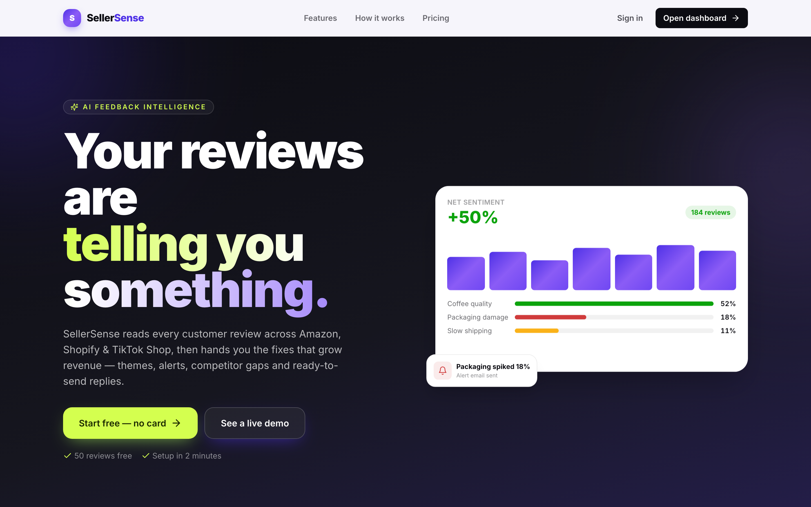

### The two plans

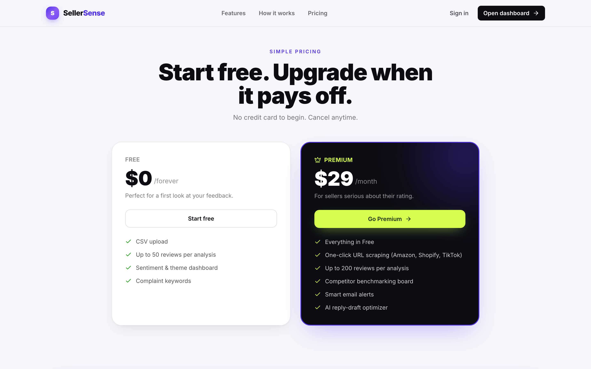

| | Free — $0 | Premium — $29 / month |
|---|---|---|
| Reviews per upload | up to **50** | up to **200** |
| Sentiment analysis, theme discovery, complaint keywords, review drill-down | ✅ | ✅ |
| Competitor benchmarking | — | ✅ |
| Smart alerts | — | ✅ |
| AI reply drafts | — | ✅ |

Both plans are live and self-serve — you can move from Free to Premium inside the app in under a minute (see [Workflow 3](#45-workflow-3--upgrade-to-premium)), and back again.

### Creating an account

Click **Start free** → fill in your name, email and a password of at least 6 characters → **Create free account**. You are signed straight in.

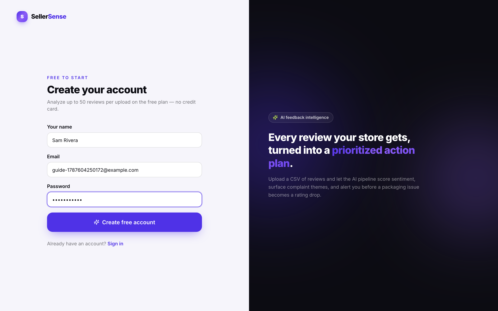

A brand-new account has no data yet, so the dashboard invites you to upload something:

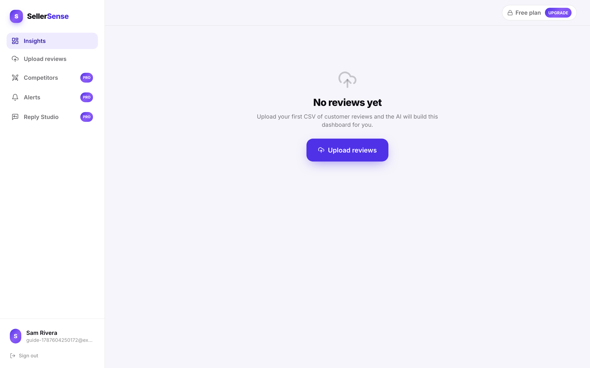

---

## 4.2 A tour of the screens

The left-hand sidebar is the whole application:

| Menu item | What it is for |
|---|---|
| **Insights** | The main dashboard — sentiment, themes, keywords, individual reviews |
| **Upload reviews** | Bring in a new CSV file of reviews |
| **Competitors** `PRO` | How your feedback compares with rival products |
| **Alerts** `PRO` | Automatic warnings when a complaint grows past a threshold |
| **Reply Studio** `PRO` | Drafted replies to specific negative reviews |

Items marked `PRO` are Premium features. On a Free account they are visible but locked — clicking one explains what it does and offers the upgrade.

At the top of every screen: the **dataset switcher** (left) lets you move between uploads; the **plan chip** (right) shows your current plan and doubles as the upgrade button.

---

## 4.3 Workflow 1 — Analyse your reviews (5 minutes)

### Step 1: Prepare your CSV file

Export your reviews from Amazon Seller Central, Shopify, TikTok Shop or any tool that produces CSV, and make sure the file has these **four columns with exactly these names**:

| Column | Meaning | Example |
|---|---|---|
| `author` | Reviewer name | `Marcus T.` |
| `rating` | Star rating, a whole number **1–5** | `2` |
| `text` | The review itself | `Unit arrived dented with the box torn open.` |
| `created_at` | When it was written, in ISO format `YYYY-MM-DDTHH:MM:SSZ` | `2026-04-20T11:00:00Z` |

A valid file looks like this:

```csv
author,rating,text,created_at
Marcus T.,2,Unit arrived dented with the box torn open. Had to request a replacement.,2026-04-20T11:00:00Z
Priya S.,5,Genuinely great espresso for the size. Crema is excellent.,2026-04-22T09:15:00Z
```

**Don't have a file handy?** Four ready-made samples ship with the project in `backend/data/`: 50 Amazon reviews, 30 Shopify, 150 TikTok Shop, and a 200-row combined file. Each has a different complaint profile, so they make genuinely different dashboards.

### Step 2: Upload

Go to **Upload reviews**, then:

1. Choose your file (drag and drop, or click to browse).
2. Give the dataset a name you will recognise later — e.g. *"Amazon — August reviews"*.
3. Enter the product name.
4. Pick the sales channel (Amazon / Shopify / TikTok Shop / Other).
5. Click **Upload & analyze**.

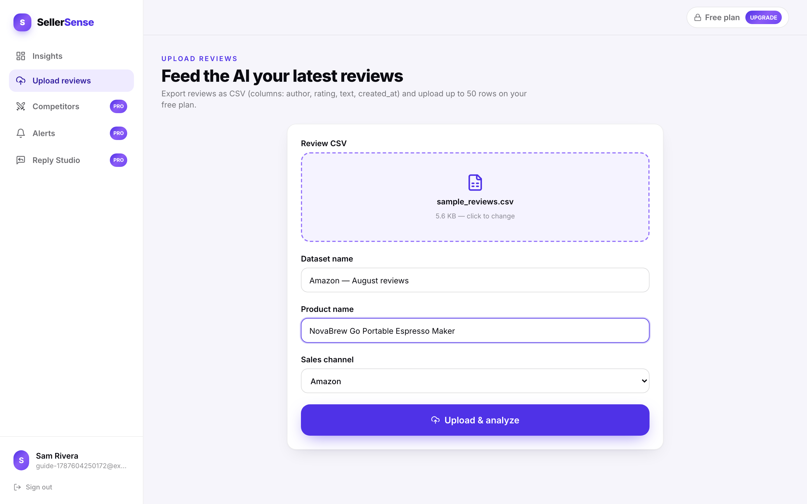

### Step 3: Wait for the analysis

A progress bar appears. The AI is doing six things in order: scoring the sentiment of every review, converting each one into a numeric fingerprint, grouping similar reviews into themes, naming and summarising each theme, counting complaint keywords, and checking whether any theme is big enough to deserve an alert.

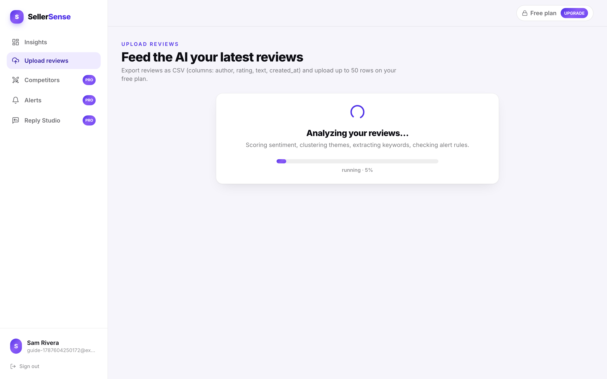

**How long?** Typically 20–40 seconds for 50 reviews. The very first analysis after a quiet period takes longer, because the server has to wake up. You can leave the page — the work continues on the server.

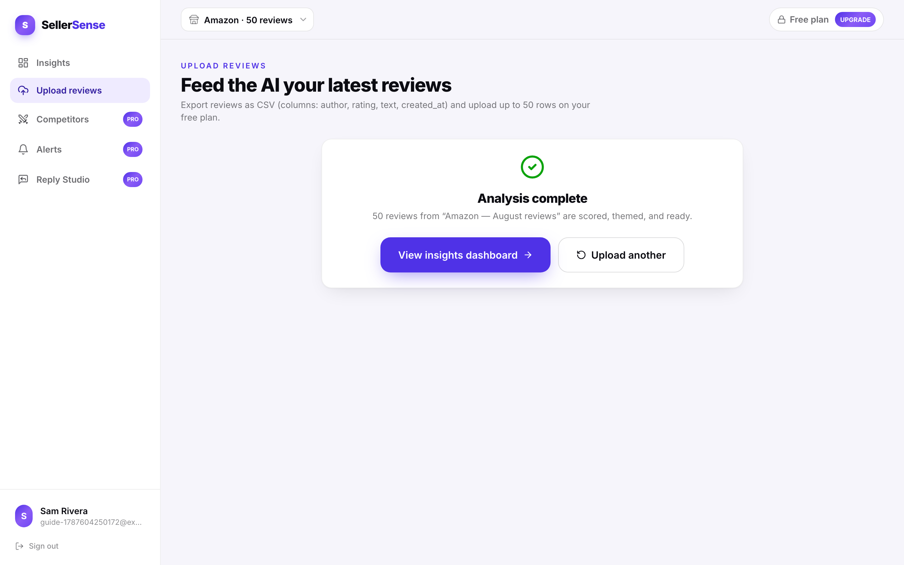

Click **View insights dashboard**.

---

## 4.4 Workflow 2 — Read the insights dashboard

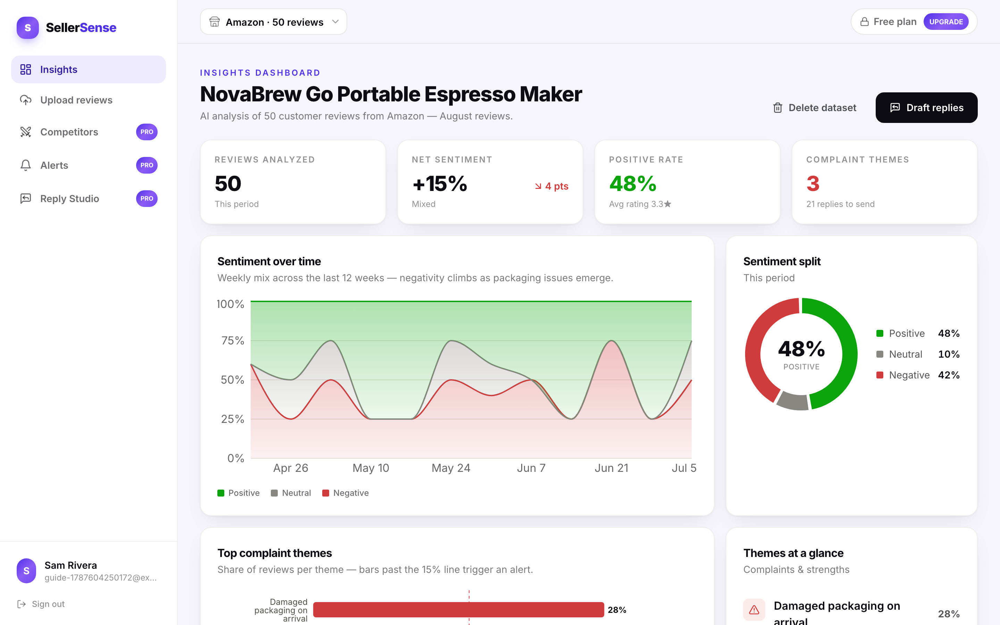

### The four tiles at the top

| Tile | What it means | How to read it |
|---|---|---|
| **Reviews analyzed** | How many reviews are in this dataset | — |
| **Net sentiment** | Positive share minus negative share | `+15%` = more happy than unhappy customers. The small arrow shows the change against the earlier half of the period |
| **Positive rate** | Share of reviews that are positive, with your average star rating | 48% positive with a 3.3★ average means opinion is split, not lukewarm |
| **Complaint themes** | How many distinct problems the AI found, and how many reviews are worth replying to | `3` means three separate problems — not three complaints |

### The charts

- **Sentiment over time** — weekly positive/neutral/negative mix across the last 12 weeks. This is where you see a problem *starting*, which is the entire point of the product: catching a packaging issue in week 1 instead of week 6.
- **Sentiment split** — the same data as a single snapshot.
- **Top complaint themes** — the share of reviews in each complaint theme. The dashed line is the alert threshold (15%): a bar past it is big enough to act on.
- **Themes at a glance** — every theme found, complaints and strengths together, each with a plain-language summary of what customers actually said.
- **Complaint keywords** — the words appearing most often in negative reviews. Useful for spotting the exact phrasing customers use.
- **Reviews** — the individual reviews behind everything above. This is the drill-down: when a theme looks alarming, read the actual text before acting.

Scroll for the full picture ([full-page screenshot](images/guide/09-dashboard-full.png)).

### Switching between datasets

Use the dropdown at the top left (*"Amazon · 50 reviews"*). Each upload is analysed separately, so you can compare channels or months by switching between them.

---

## 4.5 Workflow 3 — Upgrade to Premium

Three Premium features exist: competitor benchmarking, smart alerts, and AI reply drafts. On a Free account, opening one shows what it does and how to unlock it:

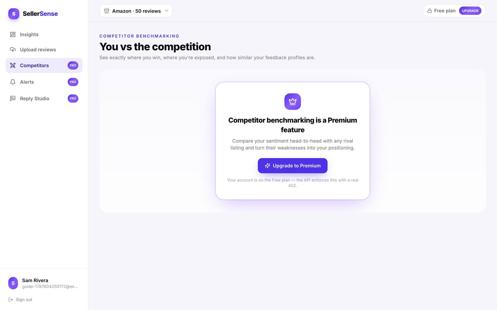

**To upgrade:**

1. Click **Upgrade to Premium** on that card — or the **Free plan** chip in the top-right corner from anywhere in the app. (**Go Premium** on the home page's pricing section leads to the same plans page, taking you through sign-in or registration first if needed. That shortcut is in the code but **takes effect with the next deployment** — on the currently deployed build it still lands on the dashboard, so use the plan chip.)
2. Compare the plans and click **Activate Premium**.

   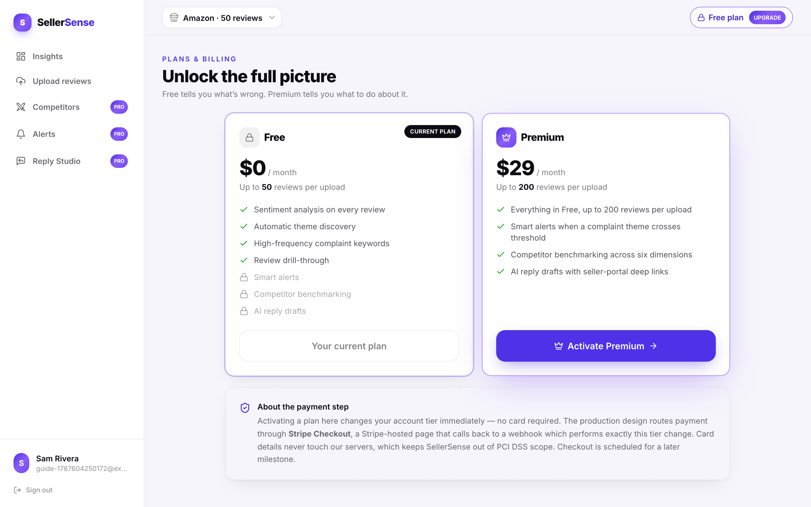

3. Review your order: plan, price, billing period and total. Choose a payment method (card, PayPal or Apple Pay) and click **Complete purchase**.

   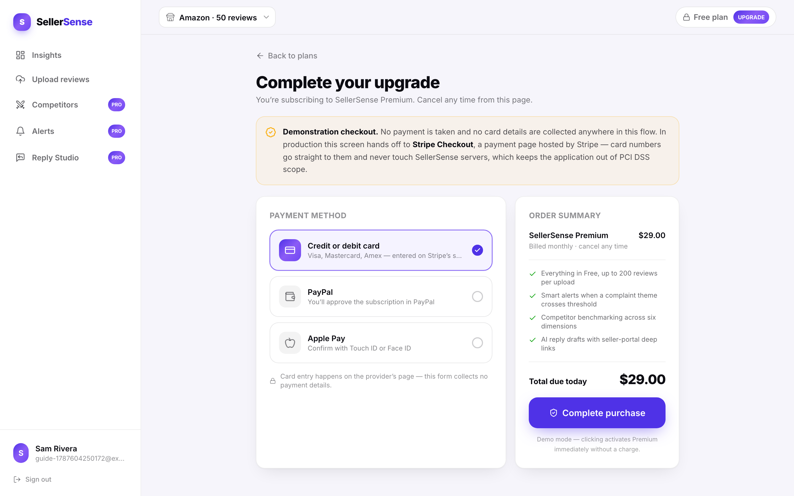

4. Premium is active immediately — no waiting, no signing out and back in. The chip in the top bar now reads **Premium** and the `PRO` locks are gone.

   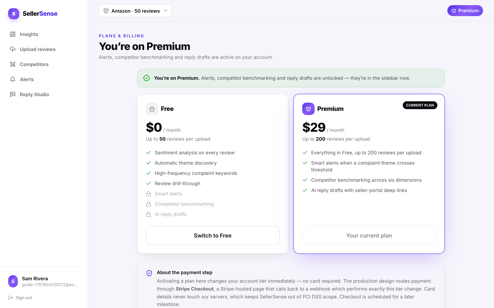

> **Important — please read.** This is a **university capstone demonstration**, and the payment step is simulated. The checkout page deliberately collects **no card details at all** — there is no card-number field and no CVV field anywhere on it. Nothing is charged, and no payment information is requested or stored. In a commercial deployment this step would hand you over to Stripe's own hosted checkout page, so card data would never touch SellerSense's servers. The *plan change itself* is completely real: your account genuinely becomes Premium and the features genuinely unlock.

You can return to the Free plan the same way, from the plan chip.

---

## 4.6 Workflow 4 — Premium features

### Competitors

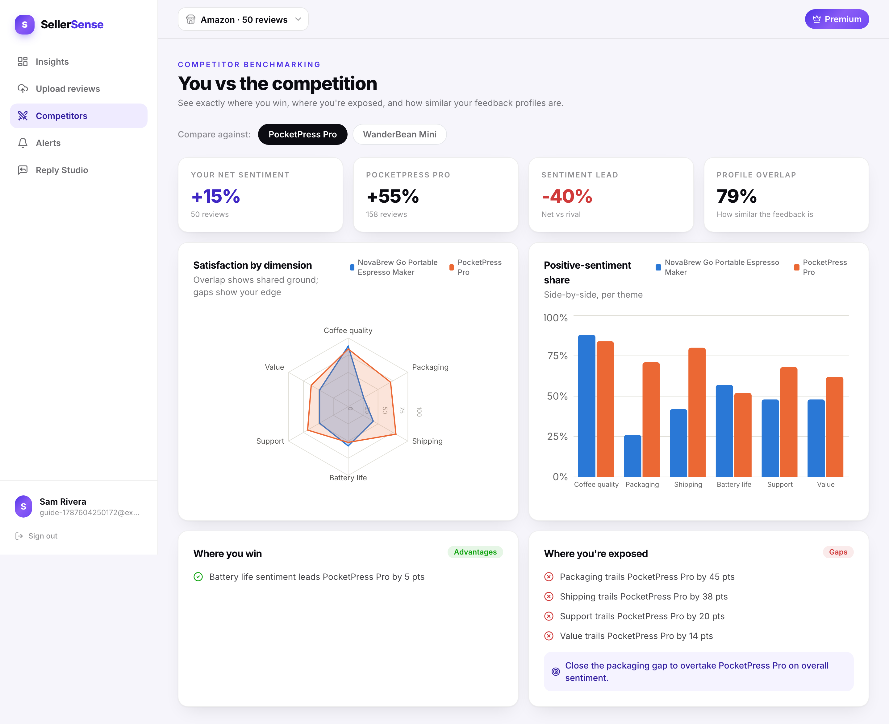

Compares your feedback profile against rival products across six dimensions. For each competitor you get an **overlap score** (how similar your customers' concerns are), your **advantages**, and your **gaps** — the areas where they are beating you. Use the gaps as a to-do list.

### Alerts

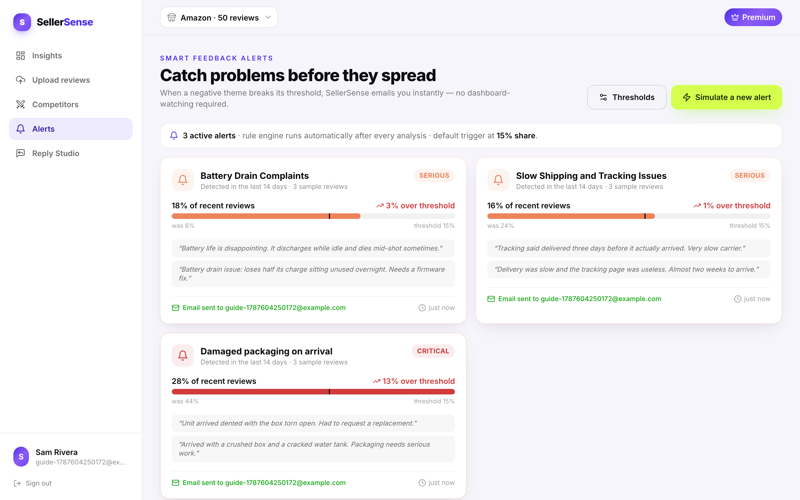

The system raises an alert when a complaint theme grows past 15% of your reviews, graded *warning*, *serious* or *critical* by how far past the line it is. Each alert names the theme, its share, and the address that would be notified. (In this demonstration the notification email is simulated rather than actually sent — see [limitations](#48-known-limitations--gotchas).)

### Reply Studio

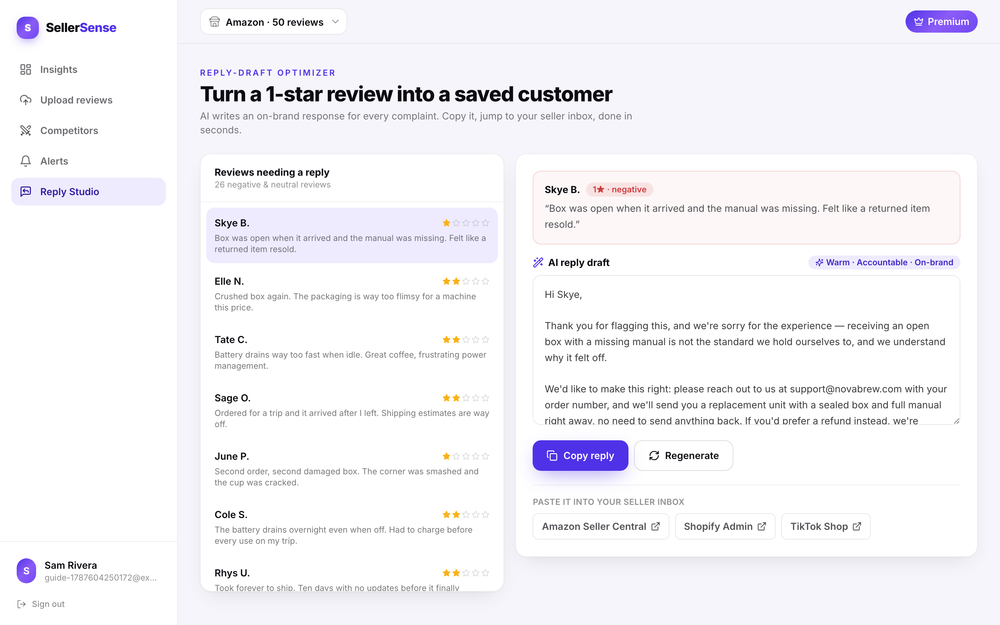

Pick a negative review and the AI drafts a reply written for *that* review — acknowledging the specific problem, offering a matching remedy, and keeping a consistent brand voice. **Copy** puts it on your clipboard, and the portal link takes you to the right place in Amazon Seller Central, Shopify Admin or TikTok Seller Center to paste it.

Always read a draft before sending. It is a first draft written by an AI, not an approved company statement.

---

## 4.7 Workflow 5 — Delete a dataset

On the dashboard, click **Delete dataset** (top right). Because deleting throws away an analysis that took real time to produce, it asks first:

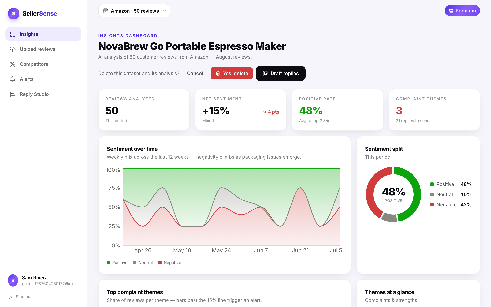

The **first click only asks** — nothing is deleted. Click **Yes, delete** to confirm, or **Cancel** to back out.

Deleting removes the dataset **and everything derived from it**: the reviews, the analysis, the themes, the keywords, the alerts and any reply drafts. This cannot be undone. If you still have the original CSV you can simply upload it again.

---

## 4.8 Known limitations & gotchas

Please read this section before judging the product — these are deliberate boundaries of a capstone demonstration, not bugs.

| Limitation | What it means for you |
|---|---|
| **Upload caps: 50 reviews (Free), 200 (Premium)** | A larger file is rejected with a message telling you the cap and how many rows your file has. Split the file, or upload the most recent reviews |
| **CSV only** | There is no automatic import from Amazon/Shopify/TikTok yet. The home page mentions URL scraping as a Premium feature; that is **not implemented** — every upload is a CSV file today |
| **Payment is simulated** | The checkout collects no card details and nothing is charged. The plan change itself is real |
| **Alert emails are simulated** | Alerts appear in the app and record who *would* be notified; no email is actually sent |
| **The exact wording of AI output varies between runs** | Theme names and summaries are written by an AI model, so re-analysing the same file can produce slightly different phrasing. The findings stay consistent; the words are not identical |
| **An analysis can occasionally be interrupted** | The demo server shuts down when idle. If a progress bar sits unchanged for several minutes, delete the dataset and upload again |
| **The first action after a quiet period is slow** | The server sleeps when nobody is using it and takes about 10 seconds to wake up. This affects the first click only |
| **The demo database may be paused between demonstrations** | To keep hosting costs near zero, the database is sometimes stopped. If sign-in fails with an error, contact the maintainer — restarting it takes about two minutes |
| **English reviews** | Analysis is tuned for English-language reviews |
| **Your data is not private in a demo sense** | This is a class project on a shared demonstration deployment. **Do not upload real customer data or anything confidential.** Use the sample files or anonymised exports |
| **Desktop-first** | The interface is built for laptop and desktop screens. It works on a tablet; phone layouts are not optimised |
| **No password reset** | There is no "forgot password" flow. If you lose a test account's password, register another one |

---

## 4.9 Troubleshooting

| What you see | What it means | What to do |
|---|---|---|
| *"CSV is missing required columns: …"* | Your file's header row does not have all four required names | Rename your columns to exactly `author`, `rating`, `text`, `created_at` |
| *"Row 2: …"* type error | One row has a bad value — most often a rating outside 1–5, or a date that isn't ISO format | Fix that row and re-upload. The message names the row |
| *"Free tier is limited to 50 reviews per upload; the file contains 60 rows."* | Your file is over the plan's cap | Split the file, or upgrade to Premium (200) |
| *"Analysis is not finished yet"* | You opened the dashboard before the AI finished | Wait a few seconds; the page retries on its own |
| A page says a feature is Premium | You are on the Free plan | Follow [Workflow 3](#45-workflow-3--upgrade-to-premium), or use the `demo@novabrew.co` account |
| Sign-in fails for everyone, site otherwise loads | The demonstration database is paused or unreachable | Contact the maintainer — see below |
| The first click after a while takes ~10 seconds | The server was asleep | Normal; it only affects the first request |
| A progress bar never completes | The analysis was interrupted | Delete the dataset and upload again |

---

## 4.10 Support

| | |
|---|---|
| **Maintainer** | Yinan (project owner) |
| **Email** | yiileanor920@gmail.com |
| **Issues / bug reports** | Open an issue on the project repository, including what you did, what you expected, what happened, and the time it happened |
| **Live application** | https://sellersense-ai.web.app |
| **Service status, first check** | https://sellersense-ai.web.app/api/health — `"status":"ok"` means the application is running; `"database":"up"` means it can reach its data |

When reporting a problem, the most useful details are: the approximate time, the account email you used, the dataset name, and a screenshot. That is usually enough to find the matching entry in the server logs.

---

*Next:* [§5 Architecture Diagram](05-architecture.md) · *Back to* [Documentation index](README.md)
