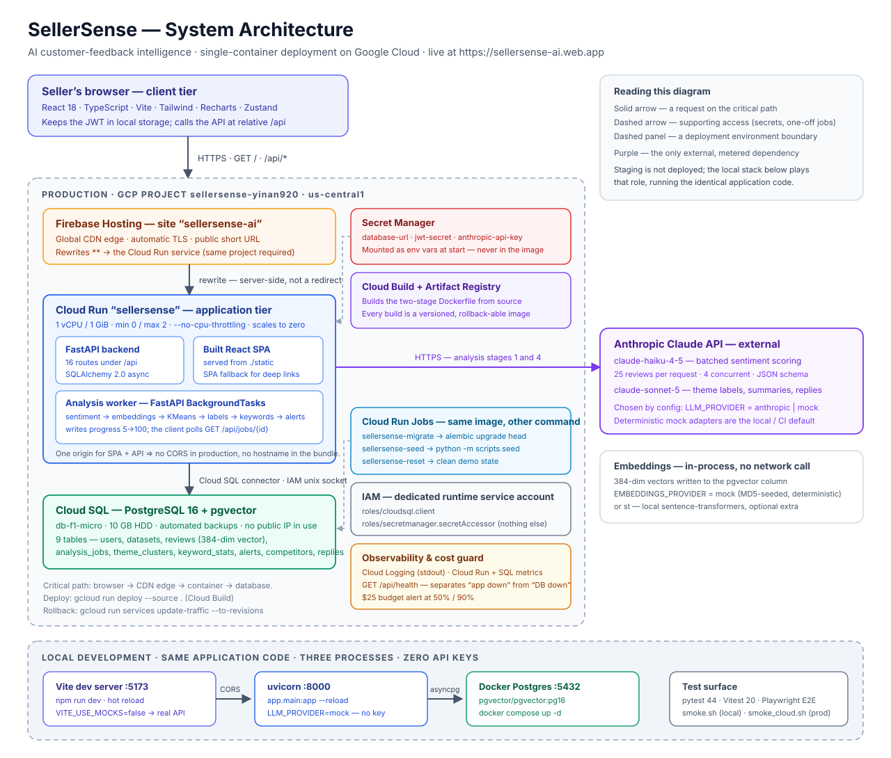

# 5. Architecture

---

## 5.1 High-level architecture diagram



> The diagram is an SVG — open [`images/architecture.svg`](images/architecture.svg) directly to zoom without losing detail.

**How to read it:** solid arrows are requests on the critical path; dashed arrows are supporting access (secrets, one-off jobs); dashed panels are deployment environment boundaries; purple marks the one external, metered dependency.

The shape in one line: **a single container serves both the API and the built frontend, behind a CDN, in front of one managed database.**

---

## 5.2 Components and their roles

### Client tier

| Component | Role | Technology |
|---|---|---|
| Single-page application | Everything the user sees: landing page, auth, upload, dashboard, premium screens | React 18, TypeScript, Vite, Tailwind, Recharts (charts), Zustand (auth/app state), React Query (server state and caching) |
| Auth token | Keeps the session; attached as `Authorization: Bearer <jwt>` to every API call | JWT in browser local storage |

The SPA calls the API at the **relative** path `/api`, so no hostname is compiled into the bundle and the same build runs in any environment.

### Application tier

| Component | Role | Technology |
|---|---|---|
| HTTP API | 16 endpoints under `/api`: auth, datasets, jobs, dashboard, billing, premium features, health | FastAPI, Pydantic v2 schemas |
| Static file serving | Serves the built SPA from the same origin, with a fallback that returns `index.html` for any non-`/api` path so deep links survive a browser refresh | Starlette `StaticFiles` + a catch-all route registered **after** the API router |
| Analysis worker | Runs the six-stage AI pipeline after the upload response has been sent | FastAPI `BackgroundTasks`, behind a `JobRunner` protocol |
| ORM / data access | Async database access, one session per request | SQLAlchemy 2.0 async + asyncpg |
| Schema migrations | Versioned schema, applied as a discrete operation | Alembic |
| AI adapters | One interface per capability (LLM, embeddings, email) with interchangeable implementations chosen by configuration | `app/integrations/*` |

### Data tier

| Component | Role |
|---|---|
| PostgreSQL 16 | System of record: users, datasets, reviews, jobs, themes, keywords, alerts, competitors, reply drafts (9 tables) |
| pgvector extension | Stores the 384-dimension embedding of each review in a `vector` column, alongside the review text |

Full ERD and DDL: [db-design.md](db-design.md).

### External services

| Service | Role | Failure mode |
|---|---|---|
| **Anthropic Claude API** | `claude-haiku-4-5` scores sentiment in batches; `claude-sonnet-5` writes theme labels, summaries and reply drafts | **Soft** — new analyses fail, everything else keeps working; recoverable by switching to the deterministic adapters |
| **Google Cloud Run** | Runs the container; autoscaling, TLS, revisions | Hard |
| **Google Cloud SQL** | Managed Postgres with backups | Hard |
| **Secret Manager** | Holds `database-url`, `jwt-secret`, `anthropic-api-key` | Hard at instance start only |
| **Cloud Build + Artifact Registry** | Builds and versions images | Build-time only |
| **Firebase Hosting** | CDN edge and the short public URL, rewriting everything to Cloud Run | Edge only |

Embeddings are **not** an external call: the default provider generates deterministic 384-dimension vectors in-process, and the optional `st` provider runs a local sentence-transformers model. Nothing about review text leaves the system for embeddings.

---

## 5.3 Communication flows

### Flow A — Sign in

```
Browser ──POST /api/auth/login {email, password}──▶ FastAPI
                                                     │ verify bcrypt hash
                                                     │ sign JWT (HS256, 24 h)
Browser ◀──200 {token, user{tier}}───────────────────┘
Browser stores the token and sends it as Authorization: Bearer on every later call.
```

### Flow B — Upload and analysis (the core path)

This is the only asynchronous flow in the system, and the one worth understanding.

```mermaid
sequenceDiagram
    participant B as Browser
    participant A as FastAPI (Cloud Run)
    participant W as Analysis worker (same process)
    participant D as PostgreSQL + pgvector
    participant C as Claude API

    B->>A: POST /api/datasets/upload (multipart CSV)
    A->>A: parse + validate rows; enforce tier cap
    A->>D: INSERT dataset, reviews, analysis_job(queued)
    A-->>B: 201 {dataset, job}
    Note over A,W: response already sent; work continues in-process
    W->>C: stage 1 — batched sentiment (25/request, 4 concurrent)
    W->>D: write scores, progress 30
    W->>W: stage 2 — 384-dim embeddings (in-process)
    W->>D: write vectors, progress 50
    W->>W: stage 3 — KMeans clustering, k = min(8, √(n/2))
    W->>C: stage 4 — label and summarise each cluster
    W->>D: write themes, progress 80
    W->>W: stages 5–6 — keyword n-grams, alert rules
    W->>D: write keywords + alerts, job done, progress 100
    loop every ~1 s until done
        B->>A: GET /api/jobs/{id}
        A->>D: read status + progress
        A-->>B: {status, progress}
    end
    B->>A: GET /api/datasets/{id}/dashboard
    A->>D: aggregate KPIs, trend, themes, keywords, reviews
    A-->>B: 200 dashboard payload
```

Stage boundaries are the pipeline's own progress checkpoints (5 → 30 → 50 → 65 → 80 → 90 → 95 → 100), which is what makes the progress bar meaningful rather than decorative and what the benchmarks measure against.

**Why the upload returns before the work is done:** analysing 50 reviews takes 20–40 seconds with real models. Holding an HTTP request open for that long is fragile — it ties up a connection, risks proxy timeouts, and gives the user a frozen page. Returning `201` immediately with a job id lets the UI show real progress and lets the user navigate away.

### Flow C — Tier gating (a paywall that is real)

```
Browser ──GET /api/competitors (Bearer token)──▶ FastAPI
                                                  │ premium_required() dependency
                                                  │   user.tier != "premium"?
Browser ◀──402 {detail: "... is a Premium feature"}┘
```

The lock lives in the API, not in the interface. The frontend renders a gate because the API refuses, not the other way round — and the E2E suite asserts the 402 rather than the blur.

### Flow D — Upgrade

```
Browser ──POST /api/billing/upgrade (Bearer)──▶ FastAPI ──UPDATE users.tier──▶ DB
Browser ◀──200 {user, tier: "premium"}─────────┘
Premium endpoints answer 200 for the same token immediately — no re-login.
```

In production this endpoint's body is what a Stripe webhook handler would call after a successful hosted-checkout payment.

### Protocols and formats

| Hop | Protocol | Notes |
|---|---|---|
| Browser → Firebase Hosting | HTTPS | Automatic TLS |
| Firebase Hosting → Cloud Run | HTTPS rewrite | Server-side; the URL in the address bar does not change |
| Browser → API | HTTPS, JSON; multipart for uploads | Same origin in production, so no CORS |
| API → Cloud SQL | PostgreSQL wire protocol over an IAM-authenticated unix socket | Cloud SQL connector; no public IP path |
| API → Anthropic | HTTPS, JSON with a response schema | Guaranteed-parseable structured output |
| Container → Secret Manager | Google internal, at instance start | Injected as environment variables |

---

## 5.4 AI provider strategy, and the current production setting

Every AI capability sits behind an adapter interface with two interchangeable implementations:

| | Mock adapters | Real Claude |
|---|---|---|
| Cost / keys | $0, no API key | metered, needs `ANTHROPIC_API_KEY` |
| Output | deterministic — same input, same result | model-generated, varies in wording |
| Quality | keyword-driven heuristics; occasionally mislabels a mixed cluster | sharper labels, catches clusters the heuristic misses |
| Used for | local development, the test suites, reproducible grading | production-grade analysis |

Switching is **configuration, not code** — the `anthropic` SDK ships inside the production image, so it takes one `gcloud run services update` and no rebuild.

> **Current state, stated precisely.** The live revision (`sellersense-00012-h2w`) runs `LLM_PROVIDER=anthropic` with `EMBEDDINGS_PROVIDER=mock` — that is, **real Claude in production**, verified on 2026-08-24 by inspecting the service configuration and by the model-written theme labels in the smoke-test output. Two consequences follow: every public upload is a metered API call, and analysis output differs in wording between runs — which is exactly what broke two end-to-end assertions ([§3, issue 14](03-issue-log.md#issue-14--e2e-suite-broke-when-production-switched-from-mock-adapters-to-real-claude)).
>
> Because this setting can be changed at any time without a deploy, check it rather than trusting any document:
>
> ```bash
> gcloud run services describe sellersense --region us-central1 \
>   --format='value(spec.template.spec.containers[0].env)' | tr ',' '\n' | grep PROVIDER
> ```

---

## 5.5 Hosting and deployment environments

| | **Local development** | **Production** |
|---|---|---|
| Frontend | Vite dev server, `localhost:5173`, hot reload | Built bundle inside the container, served at `/` |
| Backend | uvicorn `--reload`, `localhost:8000` | Cloud Run service `sellersense`, us-central1 |
| Database | Docker `pgvector/pgvector:pg16`, `localhost:5432` | Cloud SQL PostgreSQL 16, `db-f1-micro`, automated backups |
| Public URL | — | https://sellersense-ai.web.app (origin: https://sellersense-yuuwat5zca-uc.a.run.app) |
| Secrets | git-ignored `.env` file | Secret Manager, injected at instance start |
| CORS | Dev server origin allow-listed | None needed — one origin |
| AI providers | mock by default, no keys | real Claude (see [5.4](#54-ai-provider-strategy-and-the-current-production-setting)) |
| Migrations | `alembic upgrade head` by hand | one-off Cloud Run Job, never at container start |
| Scaling | one process | 0–2 instances, scale to zero, `--no-cpu-throttling` |

**There is no separate staging environment.** For a project of this size, standing one up would double the cloud cost for little benefit; the local stack runs the identical application code and is where changes are verified before deploy. The honest consequence: production is the first place a change meets Cloud Run's own behaviour — which is precisely how issues [2](03-issue-log.md#issue-2--the-container-deploys-successfully-then-cannot-reach-the-database), [3](03-issue-log.md#issue-3--the-analysis-pipeline-stalls-after-the-upload-returns-201) and [16](03-issue-log.md#issue-16--a-hidden-10-second-cost-on-the-first-upload-after-a-cold-start) were found. The mitigations are a fast rollback path and a post-deployment smoke test.

---

## 5.6 Key architectural decisions

| Decision | Why | Trade-off accepted |
|---|---|---|
| **One container serves API + SPA** | The frontend calls a relative `/api`, so CORS disappears, no hostname is baked into the bundle, and there is one service to deploy, log and pay for | Frontend and backend cannot scale independently |
| **Analysis in-process via BackgroundTasks** | No queue infrastructure to run or pay for at this scale; the abstraction makes the upgrade local | An instance shutdown can kill a running analysis ([I-5](01-production-support.md#i-5--an-analysis-job-is-stuck-in-running)) |
| **Adapter interface for every AI capability** | The product is testable and gradeable with zero API keys, and switching providers is a config change | Two implementations to keep in step |
| **pgvector rather than a separate vector database** | One database to operate and back up; embeddings live next to the review they describe | Not the right choice at millions of vectors |
| **Migrations as a one-off Job** | Concurrent instances must never race Alembic | One more step in the deploy sequence |
| **Scale to zero** | A demo that costs cents when nobody is using it | ~9 s cold start on the first request |
| **404, not 403, for another user's resource** | Does not confirm that an id exists | Slightly less informative for the legitimate owner |
| **Deterministic mock adapters as the default** | Tests never flake on a model's wording, and a fresh clone runs with no keys | Mock output is visibly weaker than the real models' |

---

## 5.7 Deployment pipeline *(optional section)*

There is **no automated CI/CD pipeline** — deployment is a deliberate manual sequence. That is stated plainly rather than dressed up, and adding GitHub Actions is the highest-value next step, since every stage below is already a scripted command.

**Current pipeline, stage by stage:**

| Stage | Command | Gate |
|---|---|---|
| 1. Local verification | `pytest` (44) · `npm test` (20) · `npm run lint` | All green before anything else |
| 2. Integration check | `bash scripts/smoke.sh` against a local server | 13/13 steps pass |
| 3. Build | `gcloud run deploy sellersense --source .` — Cloud Build runs the two-stage Dockerfile and pushes a versioned image to Artifact Registry | Build succeeds |
| 4. Schema | `gcloud run jobs execute sellersense-migrate --wait` **before** traffic shifts, if the schema changed | Job exits 0 |
| 5. Release | Cloud Run creates a new revision and shifts 100% of traffic | Revision reaches ready |
| 6. Post-deployment validation | `bash scripts/smoke_cloud.sh` (10 checks) and, for a significant change, the three Playwright suites | 10/10 |
| 7. Rollback if needed | `gcloud run services update-traffic sellersense --to-revisions <previous>=100` | Seconds, no rebuild |

**Approvals:** a single-maintainer project, so the gate is the checklist above rather than a second reviewer.

**Rollback guarantees:** every deploy produces an immutable, versioned image, and Cloud Run keeps previous revisions, so a rollback is a traffic change rather than a rebuild. Database migrations are *not* automatically reversible — the discipline is additive migrations, so an older revision keeps working against a newer schema.

---

## 5.8 Security considerations *(optional section)*

### Authentication

- Passwords are hashed with **bcrypt** (`passlib`); the plaintext is never stored, and no password field is ever serialised in an API response.
- Sessions are **JWTs** signed HS256 with a 24-hour expiry; the secret comes from Secret Manager in production and is generated with `openssl rand -hex 32`.
- Every protected route resolves the token through one dependency ([`app/core/deps.py`](../backend/app/core/deps.py)); an invalid, expired or malformed token is a 401 with the same message, so a caller cannot distinguish the cases.
- Login failures return an identical message for "unknown email" and "wrong password", so the endpoint cannot be used to enumerate registered users.

### Authorization

- **Tier gating** is a server-side dependency (`premium_required`), returning a real **402** — the paywall is not a UI decoration. Four backend tests and one E2E assertion pin this.
- **Ownership isolation:** every dataset, job, dashboard and delete request is scoped to the authenticated user; another user's resource returns **404 rather than 403**, so the response does not confirm that the id exists. Three tests cover this, including cross-account delete.
- **Resource caps** (50 / 200 rows) are enforced in the API, not the browser.

### Secrets and infrastructure

- No secret is committed; `.env`, `.env.local` and the API-key scratch file are git-ignored, and `.env.example` carries only non-secret defaults.
- Production secrets live in **Secret Manager** and are injected as environment variables at instance start — not baked into the image, not visible in the deploy command.
- The service runs as a **dedicated service account** with exactly two roles: `roles/cloudsql.client` and `roles/secretmanager.secretAccessor`.
- The database has **no public-IP path in use**; the container reaches it through the IAM-authenticated Cloud SQL connector socket.
- TLS is automatic and terminated at the edge; the app is never served over plain HTTP.

### Input handling

- Uploaded CSVs are parsed and validated row by row with Pydantic (`rating` 1–5, non-empty `author`/`text`, ISO `created_at`); invalid rows produce a 422 naming the row number, and malformed files a 400.
- Files are processed **entirely in memory** — nothing is written to disk, so there is no upload directory to secure or clean.
- All database access goes through SQLAlchemy with bound parameters; no SQL is assembled from user input.
- Uploads are capped by row count before any AI work begins, which also bounds the cost of a single request.

### Payments

Card data is out of scope by design: the checkout page collects no payment fields at all, and a production deployment would redirect to **Stripe Checkout**, keeping card data off this server entirely and the application out of PCI DSS scope.

### Known gaps (honest list)

- **No rate limiting** on authentication or upload endpoints — a brute-force or cost-amplification attempt would not be throttled. This is the most significant gap for a real deployment.
- **No email verification** at registration, and no password-reset flow.
- **No refresh-token rotation**; a stolen token is valid for up to 24 hours, and the only revocation mechanism is rotating `JWT_SECRET`, which signs everybody out.
- **JWT in local storage** rather than an httpOnly cookie — simpler for a SPA, but readable by any script that manages to run on the page.
- **No audit log** of tier changes or deletions.
- **Not a multi-tenant privacy boundary.** The deployment is a demonstration; users are told in [§4.8](04-user-guide.md#48-known-limitations--gotchas) not to upload real customer data.

---

*Back to* [Documentation index](README.md)
