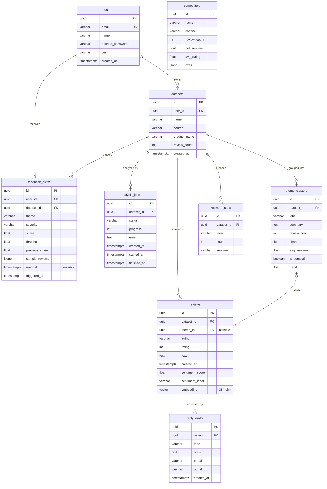

# SellerSense — Database Design

**Deliverable:** Database design and tables for the SellerSense capstone application.

**Engine:** PostgreSQL 16 with the **pgvector** extension (review embeddings live next to business data — one store, no separate vector DB). Runs via `docker-compose.yml`; any Postgres reachable through `DATABASE_URL` works. Schema is created/versioned by a single initial **Alembic** migration.

## Design conventions

- **Primary keys:** `UUID` (generated app-side), serialized as strings in the API — matches the frontend's `id: string` contract.
- **Enums:** `VARCHAR` + `CHECK` constraints instead of native Postgres enums (cheaper to evolve in future migrations).
- **Timestamps:** `TIMESTAMPTZ`, always stored UTC.
- **Ownership:** every user-owned row chains back to `users` via FKs; API queries always filter by the authenticated user, so one seller can never read another's data.
- **Cascade deletes:** deleting a dataset removes its reviews, jobs, theme clusters, keywords, and alerts.

## Entity-relationship diagram



## Table definitions (DDL)

```sql
CREATE EXTENSION IF NOT EXISTS vector;

-- 1. Accounts + tier gating
CREATE TABLE users (
    id              UUID PRIMARY KEY,
    email           VARCHAR(255) NOT NULL UNIQUE,
    name            VARCHAR(120) NOT NULL,
    hashed_password VARCHAR(255) NOT NULL,
    tier            VARCHAR(10)  NOT NULL DEFAULT 'free'
                    CHECK (tier IN ('free', 'premium')),
    created_at      TIMESTAMPTZ  NOT NULL DEFAULT now()
);

-- 2. One uploaded review collection (per channel/product)
CREATE TABLE datasets (
    id           UUID PRIMARY KEY,
    user_id      UUID NOT NULL REFERENCES users(id) ON DELETE CASCADE,
    name         VARCHAR(200) NOT NULL,
    source       VARCHAR(10)  NOT NULL DEFAULT 'csv'
                 CHECK (source IN ('amazon', 'shopify', 'tiktok', 'csv')),
    product_name VARCHAR(200) NOT NULL,
    review_count INTEGER      NOT NULL DEFAULT 0,
    created_at   TIMESTAMPTZ  NOT NULL DEFAULT now()
);
CREATE INDEX ix_datasets_user_id ON datasets(user_id);

-- 3. AI clusters over a dataset's reviews (created before reviews.theme_id FK)
CREATE TABLE theme_clusters (
    id            UUID PRIMARY KEY,
    dataset_id    UUID NOT NULL REFERENCES datasets(id) ON DELETE CASCADE,
    label         VARCHAR(120) NOT NULL,
    summary       TEXT         NOT NULL,
    review_count  INTEGER      NOT NULL DEFAULT 0,
    share         REAL         NOT NULL DEFAULT 0,      -- 0..1
    avg_sentiment REAL         NOT NULL DEFAULT 0,      -- -1..1
    is_complaint  BOOLEAN      NOT NULL DEFAULT FALSE,
    trend         REAL         NOT NULL DEFAULT 0       -- share Δ vs previous period
);
CREATE INDEX ix_theme_clusters_dataset_id ON theme_clusters(dataset_id);

-- 4. Individual reviews + AI outputs (sentiment, 384-dim embedding, theme)
CREATE TABLE reviews (
    id              UUID PRIMARY KEY,
    dataset_id      UUID NOT NULL REFERENCES datasets(id) ON DELETE CASCADE,
    theme_id        UUID REFERENCES theme_clusters(id) ON DELETE SET NULL,
    author          VARCHAR(120) NOT NULL,
    rating          INTEGER      NOT NULL CHECK (rating BETWEEN 1 AND 5),
    text            TEXT         NOT NULL,
    created_at      TIMESTAMPTZ  NOT NULL,
    sentiment_score REAL,                                -- -1..1, null until analyzed
    sentiment_label VARCHAR(10)
                    CHECK (sentiment_label IN ('positive', 'neutral', 'negative')),
    embedding       vector(384)                          -- pgvector, null until analyzed
);
CREATE INDEX ix_reviews_dataset_id ON reviews(dataset_id);
CREATE INDEX ix_reviews_theme_id   ON reviews(theme_id);

-- 5. Async pipeline runs (polled by the frontend during upload)
CREATE TABLE analysis_jobs (
    id          UUID PRIMARY KEY,
    dataset_id  UUID NOT NULL REFERENCES datasets(id) ON DELETE CASCADE,
    status      VARCHAR(10) NOT NULL DEFAULT 'queued'
                CHECK (status IN ('queued', 'running', 'done', 'failed')),
    progress    INTEGER     NOT NULL DEFAULT 0 CHECK (progress BETWEEN 0 AND 100),
    error       TEXT,
    created_at  TIMESTAMPTZ NOT NULL DEFAULT now(),
    started_at  TIMESTAMPTZ,
    finished_at TIMESTAMPTZ
);
CREATE INDEX ix_analysis_jobs_dataset_id ON analysis_jobs(dataset_id);

-- 6. High-frequency terms persisted at pipeline time (TF-IDF output)
CREATE TABLE keyword_stats (
    id         UUID PRIMARY KEY,
    dataset_id UUID NOT NULL REFERENCES datasets(id) ON DELETE CASCADE,
    term       VARCHAR(80) NOT NULL,
    count      INTEGER     NOT NULL,
    sentiment  VARCHAR(10) NOT NULL
               CHECK (sentiment IN ('positive', 'neutral', 'negative'))
);
CREATE INDEX ix_keyword_stats_dataset_id ON keyword_stats(dataset_id);

-- 7. Rule-engine output: complaint theme crossed its share threshold
CREATE TABLE feedback_alerts (
    id             UUID PRIMARY KEY,
    user_id        UUID NOT NULL REFERENCES users(id)    ON DELETE CASCADE,
    dataset_id     UUID NOT NULL REFERENCES datasets(id) ON DELETE CASCADE,
    theme          VARCHAR(120) NOT NULL,
    severity       VARCHAR(10)  NOT NULL
                   CHECK (severity IN ('warning', 'serious', 'critical')),
    share          REAL        NOT NULL,                 -- current share 0..1
    threshold      REAL        NOT NULL,                 -- configured trigger
    previous_share REAL        NOT NULL,
    sample_reviews JSONB       NOT NULL DEFAULT '[]',    -- array of excerpt strings
    read_at        TIMESTAMPTZ,                          -- null = unread
    triggered_at   TIMESTAMPTZ NOT NULL DEFAULT now()
);
CREATE INDEX ix_feedback_alerts_user_id ON feedback_alerts(user_id);

-- 8. Seeded competitor profiles for the premium benchmarking board.
--    axes JSONB: [{"axis": "Coffee quality", "score": 72}, ...] — the per-user
--    comparison (advantages/gaps/overlap) is computed at request time.
CREATE TABLE competitors (
    id            UUID PRIMARY KEY,
    name          VARCHAR(120) NOT NULL,
    channel       VARCHAR(10)  NOT NULL
                  CHECK (channel IN ('amazon', 'shopify', 'tiktok', 'csv')),
    review_count  INTEGER      NOT NULL,
    net_sentiment REAL         NOT NULL,
    avg_rating    REAL         NOT NULL,
    axes          JSONB        NOT NULL DEFAULT '[]'
);

-- 9. LLM-generated reply drafts (premium reply studio)
CREATE TABLE reply_drafts (
    id         UUID PRIMARY KEY,
    review_id  UUID NOT NULL REFERENCES reviews(id) ON DELETE CASCADE,
    tone       VARCHAR(120) NOT NULL,
    body       TEXT         NOT NULL,
    portal     VARCHAR(10)  NOT NULL
               CHECK (portal IN ('amazon', 'shopify', 'tiktok')),
    portal_url VARCHAR(255) NOT NULL,
    created_at TIMESTAMPTZ  NOT NULL DEFAULT now()
);
CREATE INDEX ix_reply_drafts_review_id ON reply_drafts(review_id);
```

## How each API reads/writes the schema

| API | Reads | Writes |
|---|---|---|
| `POST /auth/register`, `/login`, `GET /auth/me` | users | users |
| `GET /datasets`, `GET /datasets/{id}` | datasets | — |
| `POST /datasets/upload` | users (cap check) | datasets, reviews, analysis_jobs |
| AI pipeline (background) | reviews | reviews (sentiment, embedding, theme_id), theme_clusters, keyword_stats, analysis_jobs (progress), feedback_alerts |
| `GET /jobs/{id}` | analysis_jobs | — |
| `GET /datasets/{id}/dashboard` | datasets, reviews, theme_clusters, keyword_stats | — |
| `GET /competitors` | competitors + caller's datasets/theme_clusters | — |
| `GET /alerts` | feedback_alerts | — |
| `POST /reviews/{id}/reply-draft` | reviews (+theme) | reply_drafts |

## Notes & future-proofing

- **pgvector now, similarity later:** Iteration 1 only stores embeddings and clusters them in-process (KMeans). The `vector(384)` column means later iterations get semantic search / nearest-neighbor dedup with a single `ivfflat` index migration — no schema change.
- **384 dimensions** matches both the deterministic mock embedder and `all-MiniLM-L6-v2` (sentence-transformers), so switching providers requires no migration.
- **Tier caps** (`free=50`, `premium=200` reviews/upload) are enforced in the API layer from config, not the schema, so pricing changes don't need migrations.
- **Premium tables exist from day one** (competitors, feedback_alerts, reply_drafts) with real 402 gating in the API — later Stripe work only flips `users.tier`.
